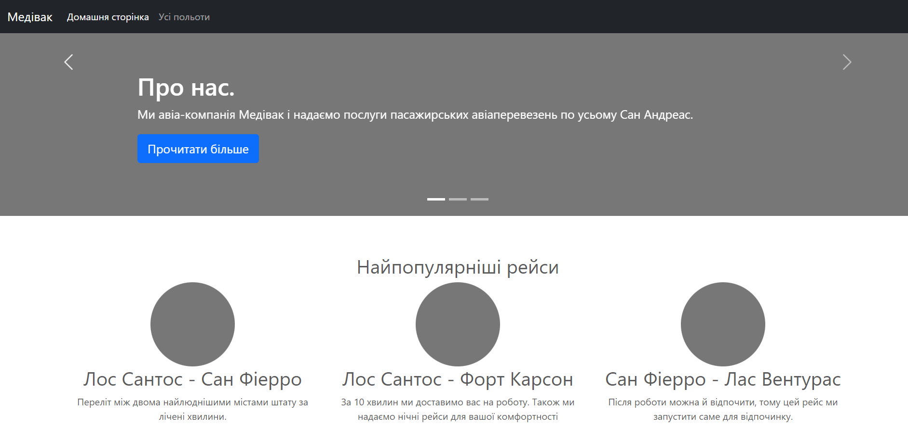
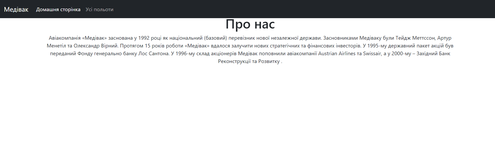
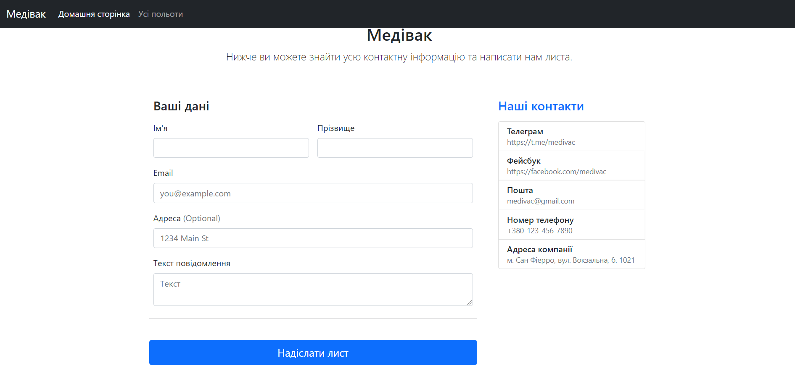
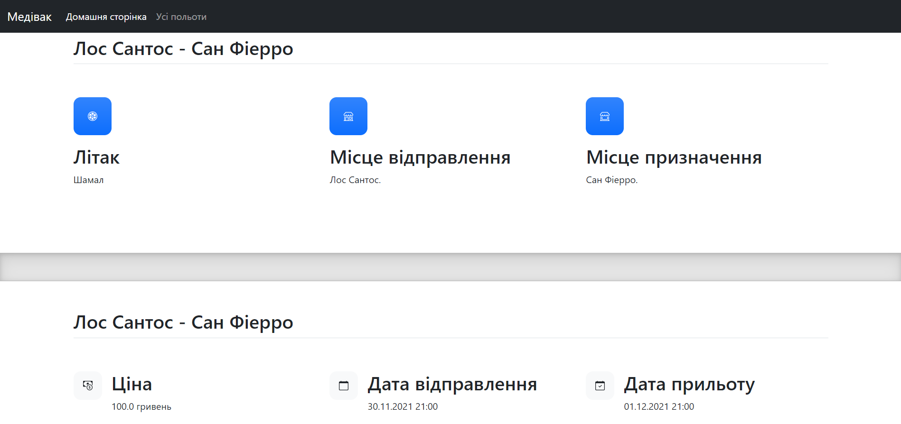
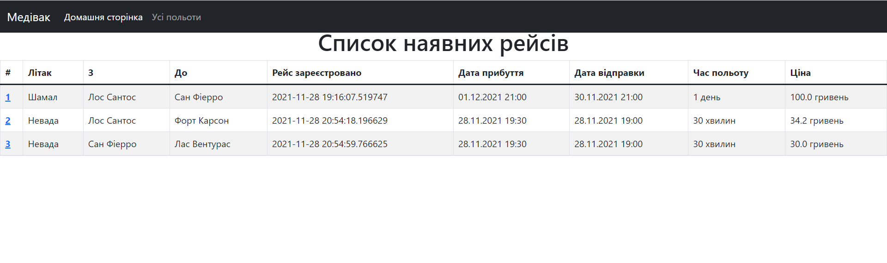

# Django app

## Overview

Django is a high-level Python web framework that encourages rapid development and clean, pragmatic design. Built by
experienced developers, it takes care of much of the hassle of web development, so you can focus on writing your app
without needing to reinvent the wheel. It’s free and open source.

## How to start

First launch the script by the command in terminal:

```bash
python manage.py runserver
```

You will see output like this:

```bash
Watching for file changes with StatReloader
Performing system checks...

System check identified no issues (0 silenced).
November 30, 2021 - 15:56:00
Django version 3.2.9, using settings 'medivac.settings'
Starting development server at http://127.0.0.1:8000/
Quit the server with CTRL-BREAK.
```

Open the `http://127.0.0.1:8000/` in your browser

> To set the database, run the command _python manage.py migrate_

## Pages

### Index

Here you can navigate to the other pages by following links, read information about our services etc.:



### About

It is the simple page, where you can read more about our company:



### Contacts

Here you can contact with the administrator of the site and ask some questions:



### Flight

On this page you can get all information about single flight:



### Flights

It is the page with the all available flights at the moment:



### Base.html

It is a template from which all pages are inherited.

```html

<!DOCTYPE html>
<html lang="en">
<head>
    <meta charset="UTF-8">
    <link href="" rel="stylesheet">
    <title>Медівак</title>
    
</head>
<body>


<script src="https://getbootstrap.com/docs/5.1/dist/js/bootstrap.bundle.min.js"></script>
</body>
</html>
```

### Navbar.html

It's just a navbar of our site.

```html
<header>
    <nav class="navbar navbar-expand-md navbar-dark fixed-top bg-dark">
        <div class="container-fluid">
            <a class="navbar-brand" href="https://github.com/mezidia/medivac" target="_blank">Медівак</a>
            <button class="navbar-toggler" type="button" data-bs-toggle="collapse" data-bs-target="#navbarCollapse"
                    aria-controls="navbarCollapse" aria-expanded="false" aria-label="Toggle navigation">
                <span class="navbar-toggler-icon"></span>
            </button>
            <div class="collapse navbar-collapse" id="navbarCollapse">
                <ul class="navbar-nav me-auto mb-2 mb-md-0">
                    <li class="nav-item">
                        <a class="nav-link active" aria-current="page" href="">Домашня сторінка</a>
                    </li>
                    <li class="nav-item">
                        <a class="nav-link" href="">Усі польоти</a>
                    </li>
                </ul>
            </div>
        </div>
    </nav>
</header>
```
