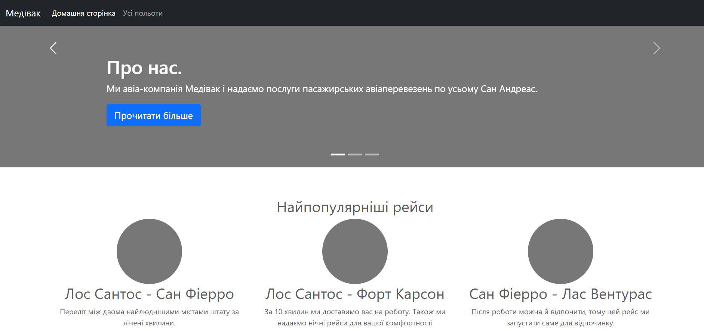
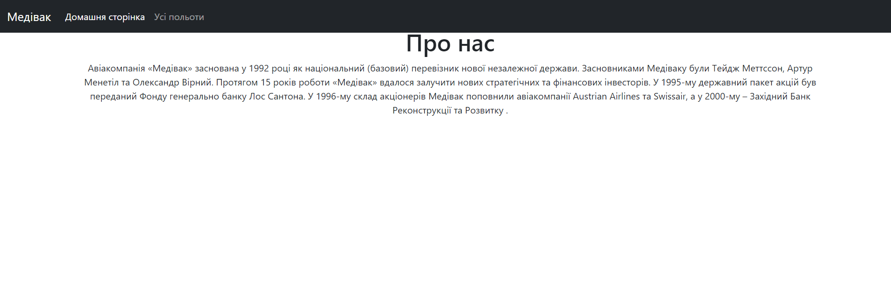
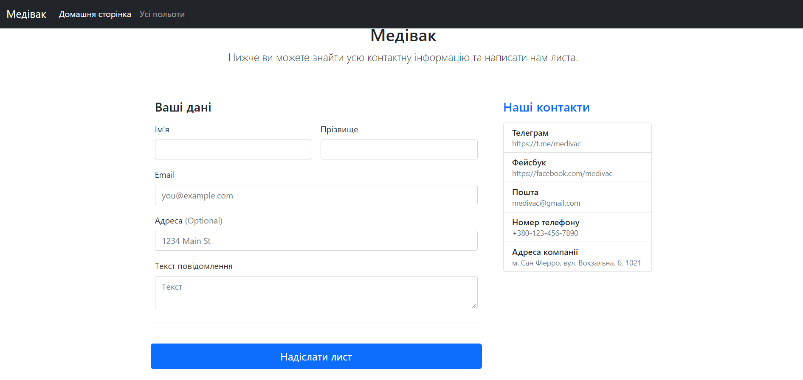
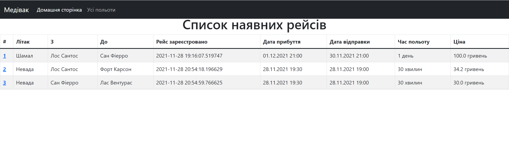

# Flask app

## Overview

Flask is a micro web framework written in Python. It is classified as a microframework because it does not require
particular tools or libraries. It has no database abstraction layer, form validation, or any other components where
pre-existing third-party libraries provide common functions. However, Flask supports extensions that can add application
features as if they were implemented in Flask itself. Extensions exist for object-relational mappers, form validation,
upload handling, various open authentication technologies and several common framework related tools.

## How to start

First launch the script by the command in terminal:

```bash
python app.py
```

You will see output like this:

```bash
FLASK_APP = app.py
FLASK_ENV = development
FLASK_DEBUG = 0
In folder C:/Users/Maxim/Desktop/Projects/medivac
C:\Users\Maxim\Desktop\Projects\medivac\venv\Scripts\python.exe -m flask run
 * Serving Flask app 'app.py' (lazy loading)
 * Environment: development
 * Debug mode: off
C:\Users\Maxim\Desktop\Projects\medivac\venv\lib\site-packages\flask_sqlalchemy\__init__.py:872: FSADeprecationWarning: SQLALCHEMY_TRACK_MODIFICATIONS adds significant overhead and will be disabled by default in the future.  Set it to True or False to suppress this warning.
  warnings.warn(FSADeprecationWarning(
 * Running on http://127.0.0.1:5000/ (Press CTRL+C to quit)
```

Open the `http://127.0.0.1:5000/` in your browser

> To set the database, import from the app **db** and run the command _db.create_all()_

## Pages

### Index

Here you can navigate to the other pages by following links, read information about our services etc.:



### About

It is the simple page, where you can read more about our company:



### Contacts

Here you can contact with the administrator of the site and ask some questions:



### Flight

On this page you can get all information about single flight:


### Flights

It is the page with the all available flights at the moment:



### Base.html

It is a template from which all pages are inherited.

```html
<!DOCTYPE html>
<html lang="en">
<head>
    <meta charset="UTF-8">
    <link href="{{ url_for('static', filename='css/bootstrap.css') }}" rel="stylesheet">
    <title>Medivac</title>
    
</head>
<body>


<script src="https://getbootstrap.com/docs/5.1/dist/js/bootstrap.bundle.min.js"></script>
</body>
</html>
```

### Navbar.html

It's just a navbar of our site.

```html
<header>
    <nav class="navbar navbar-expand-md navbar-dark fixed-top bg-dark">
        <div class="container-fluid">
            <a class="navbar-brand" href="https://github.com/mezidia/medivac" target="_blank">Медівак</a>
            <button class="navbar-toggler" type="button" data-bs-toggle="collapse" data-bs-target="#navbarCollapse"
                    aria-controls="navbarCollapse" aria-expanded="false" aria-label="Toggle navigation">
                <span class="navbar-toggler-icon"></span>
            </button>
            <div class="collapse navbar-collapse" id="navbarCollapse">
                <ul class="navbar-nav me-auto mb-2 mb-md-0">
                    <li class="nav-item">
                        <a class="nav-link active" aria-current="page" href="/">Домашня сторінка</a>
                    </li>
                    <li class="nav-item">
                        <a class="nav-link" href="/flights">Усі польоти</a>
                    </li>
                </ul>
            </div>
        </div>
    </nav>
</header>
```
## Code of the app

The full length of the app is near **50 lines**, so it is better to watch the code at
[GitHub](https://github.com/mezidia/medivac/blob/main/app.py).
